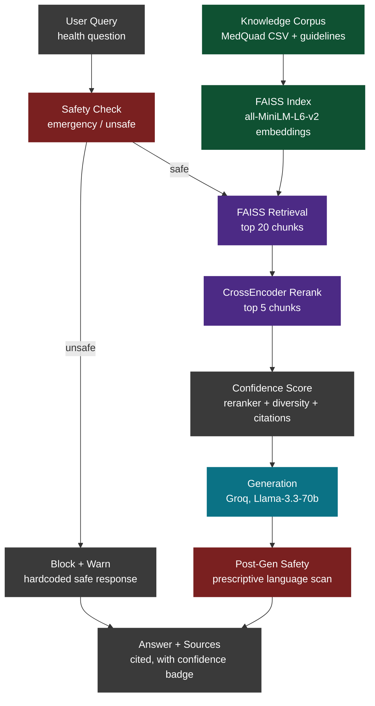

# Healthcare RAG Assistant — Architecture

```mermaid
flowchart TD
    A["User Query<br/>health question"]:::general --> B["Safety Check<br/>emergency / unsafe"]:::safety

    B -->|unsafe| H["Block + Warn<br/>hardcoded safe response"]:::general
    B -->|safe| C["FAISS Retrieval<br/>top 20 chunks"]:::retrieval

    K["Knowledge Corpus<br/>MedQuad CSV + guidelines"]:::data --> V["FAISS Index<br/>all-MiniLM-L6-v2 embeddings"]:::data
    V --> C

    C --> R["CrossEncoder Rerank<br/>top 5 chunks"]:::retrieval
    R --> S["Confidence Score<br/>reranker + diversity + citations"]:::general

    S --> G["Generation<br/>Groq, Llama-3.3-70b"]:::llm
    G --> P["Post-Gen Safety<br/>prescriptive language scan"]:::safety

    P --> U["Answer + Sources<br/>cited, with confidence badge"]:::general
    H --> U

    classDef data fill:#0f5132,stroke:#0f5132,color:#ffffff
    classDef retrieval fill:#4c2a85,stroke:#4c2a85,color:#ffffff
    classDef llm fill:#0b7285,stroke:#0b7285,color:#ffffff
    classDef safety fill:#7a2020,stroke:#7a2020,color:#ffffff
    classDef general fill:#3a3a3a,stroke:#3a3a3a,color:#ffffff
```
